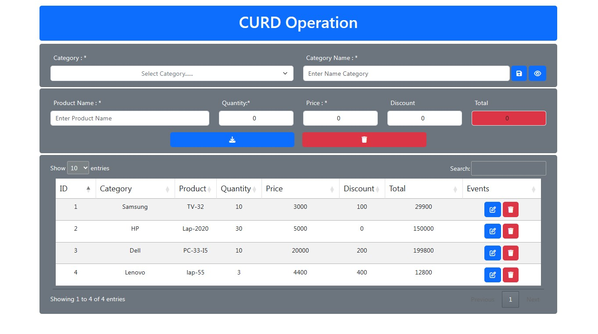
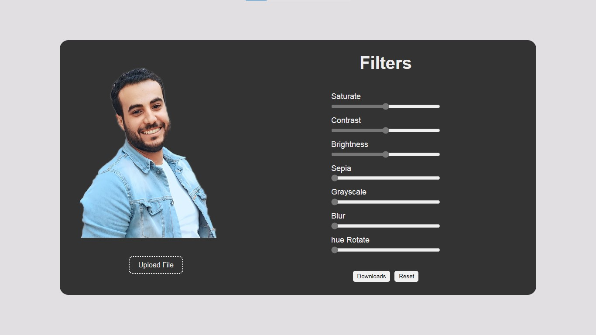
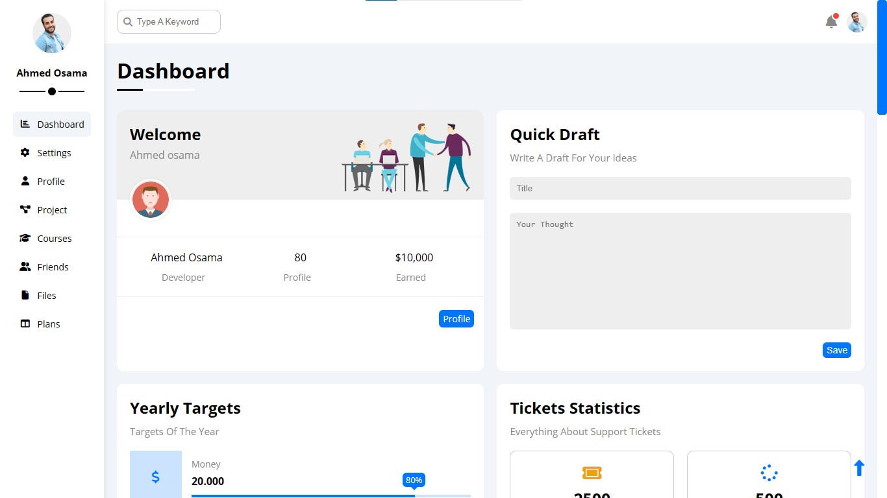
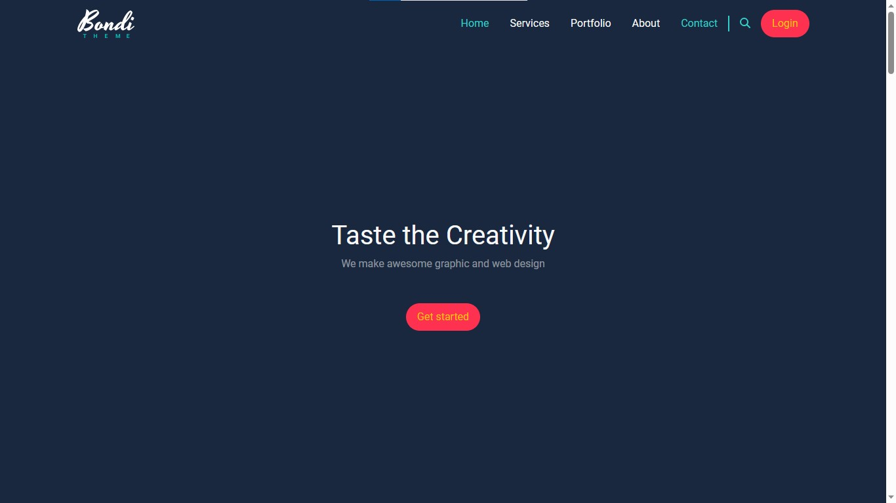

# My-Projects
 ### 19 projects are collected in this repository, each of which includes HTML, CSS and JS technologies.

## 18-Dashboard Two
The Dashboard Is Comprised Of Four Pages. The Initial Page Exhibits Graphs And Tables, While The Second Features A Calendar Enabling Users To Add Appointments And Essential Events Throughout The Month. On The Third Page, A Todo App Is Presented, Offering Functionalities Like Adding, Deleting, And Rearranging Important Tasks. Finally, The Fourth Page Showcases A Table Containing Customer Information.
#### Demo :[Dashboard Two](https://ahmedosama0js.github.io/My-Project/dashboard-2/index.html)

 

###### -------------------------------------------

## 19-Quran Karem
The Holy Qur'an Application Is A Robust And Feature-Rich Platform Crafted Using HTML, CSS, And JS Complemented By A 4-Page Structure. The Initial Page Encompasses The Entire Holy Qur'an, Featuring The Voices Of 46 Reciters. It Includes An Engaging Audio Player With Controls For Adjusting Volume, Advancing, Or Delaying The Recitation. The Second Page Provides The Text Of The Qur'an, Allowing Users To Click On Any Verse For Reading. On The Third Page, There Is A Live Radio Broadcast Featuring Recitations From Various Sheikhs. The Fourth Page Offers A Live Stream Of The Holy Qur'an Channel.
#### Demo :[Quran Karem](https://ahmedosama0js.github.io/My-Project/quran%20karem/astmaa.html)

 

###### -------------------------------------------

## 17-Snake Game
The Renowned Snake Game Is Enhanced With Customizable Speed Levels And Can Be Controlled On Computer Screens Using The Keyboard. Additionally, It Is Optimized For Mobile Screens, Allowing Users To Control The Snake's Movement Directly Through The Phone Screen.
#### Demo :[Snake Game](https://ahmedosama0js.github.io/My-Project/snake%20game/index.html)

 

###### -------------------------------------------

## 16-Natega
An Application Designed To Showcase The Results Of Final Exams Upon Completion. The Program Displays The Student's Evaluation In Each Subject, Accompanied By A Graph Illustrating The Student's Performance Level In The Exam.
#### Demo :[Natega](https://ahmedosama0js.github.io/My-Project/natega/index.html)

 

###### -------------------------------------------

## 15-Quiz App
Application Has Been Developed Where Questions Are Presented Sequentially. Upon Completing An Answer, Users Progress To The Next Question. At The End Of The Test, There's An Option To Display The Results, Including A Progress Bar Indicating Completed And Remaining Questions. Additionally, The Application Provides A Final Assessment Of The Student's Level Based On The Answered Questions.
#### Demo :[Quiz App](https://ahmedosama0js.github.io/My-Project/Quiz%20App/index.html)

 

###### -------------------------------------------

## 14-Quran API
A Program Designed For Reading The Entire Qur'an Comes Equipped With Features Allowing Users To Save Verses For Playback Upon Clicking, Along With The Capability To Navigate Forward Or Backward Through Verses. The Program Is Responsive, Ensuring Optimal Functionality Across All Screen Sizes.
#### Demo :[CURD](https://ahmedosama0js.github.io/My-Project/Quran%20API/index.html)

 

###### -------------------------------------------

## 13-CURD
An Inventory Management Program Was Developed To Input And Calculate Product Details, Including Type, Number, Quantity, And Discounts. The Collected Data Is Then Stored In A Table, Facilitating The Display Of Product Information And Quantities Within The Warehouses. The Program Is Constructed Using HTML, CSS, JavaScript, And Bootstrap.
#### Demo :[CURD](https://ahmedosama0js.github.io/My-Project/CURD/curd.html)

 

###### -------------------------------------------

## 12-Medic Cear
A Webpage For A Medical Complex Is Designed To Showcase Information About Doctors And Clients, Including Client Evaluations Of The Facility. The Page Also Features A Form For Booking Appointments. The Design Is Responsive Across All Screens, Achieved Through The Use Of Bootstrap And Subtle Animations.
#### Demo :[Medic Cear](https://ahmedosama0js.github.io/My-Project/Medic%20Cear/index.html)

 

###### -------------------------------------------

## 11-Puzzle Game
Puzzle Game: A Random Selection Forms The Foundation Of The Puzzle Game, Where An Image Is Fragmented Into Smaller Pieces For Users To Arrange On The Opposite Side Of The Page. This Interactive Game Was Developed Using JavaScript And The Canvas Element, Only Works With Computer.
#### Demo :[Puzzle Game](https://ahmedosama0js.github.io/My-Project/puzzle%20game/puzzle-game.html)

 

###### -------------------------------------------

## 10-Personal Page
I Crafted A Personal Webpage Utilizing HTML, CSS, JS, And Bootstrap. This Page Showcases Personal Information And Allows Users To Customize The Primary Page Colors. The Data Is Stored Locally, Leveraging Storage Facilities. The Design Incorporates Animations And Is Responsive To Various Screen Sizes.
#### Demo :[Personal Page](https://ahmedosama0js.github.io/My-Project/personal%20page/index.html)

 

###### -------------------------------------------

## 9-Todo App
The Animation Application Is Designed To Add Daily Tasks That Need To Be Accomplished Throughout The Day, With The Ability To Track Task Progress Through Marking Or Deleting Them. The Application Relies On Local Storage For Data Persistence And Features A Responsive Design For Various Screens, Enhancing The User Experience With Added Animation Effects.
#### Demo :[Todo App](https://ahmedosama0js.github.io/My-Project/ToDo/ToDo.html)

 

###### -------------------------------------------

## 8-Memory Game
The Classic Card Game, Known As 'Identical,' Involves Flipping Cards Sequentially And Counting Them Upside Down. The Objective Is To Identify Matching Cards As They Are Revealed.
#### Demo :[Memory Game](https://ahmedosama0js.github.io/My-Project/Memory%20Card/memory-game.html)

 

###### -------------------------------------------

## 7-Filter App
Application For Image Manipulation Using HTML, CSS, And JavaScript. The Image Is Downloaded, Undergoes Modification, And Is Then Saved To The Device Upon Completion Of The Editing Process.
#### Demo :[Filter App](https://ahmedosama0js.github.io/My-Project/filter%20app/filter.html)

 

###### -------------------------------------------

## 6-Dashboard One
The Dashboard Is Designed With 8 Fully Responsive Pages On All Screen Sizes. This Includes The Home Page, Settings Page, Profile Page, Projects Page, Courses Page, Friends Page, Files Page, And Pricing Plans Page. The Design Was Implemented Using HTML And CSS To Achieve Distinct Visual Appeal.
#### Demo :[Dashboard One](https://ahmedosama0js.github.io/My-Project/Dashbord-1/index.html)

 

###### -------------------------------------------

## 5-Template Five
Using HTML, CSS, And Bootstrap, I Created A Page Consisting Of Five Sections: [Services, Portfolio, About, And Contact]. The Page Has A Creative Design And Technology That Makes It Responsive To All Screen Sizes And Devices.
#### Demo :[Template Five](https://ahmedosama0js.github.io/My-Project/Template-bootstrap-1/index.html)

 

###### -------------------------------------------

## 4-Template Four
Using HTML And CSS, I Designed A Web Page With 15 Sections. Page Orientation Has Been Optimized To Be Responsive To All Screen Sizes. In Addition, Simple Animations Using JavaScript Have Been Added To Enhance The Page's Appeal.
#### Demo :[Template Four](https://ahmedosama0js.github.io/My-Project/Template-4/index.html)

 

###### -------------------------------------------

## 3-Template Three
Using HTML And CSS, I Have Created A Page Consisting Of Six Sections: The Page Features A Creative Design And Technology That Makes It Responsive To All Screen Sizes And Devices.
#### Demo :[[Template Three](https://ahmedosama0js.github.io/My-Project/template-3/Index.html))

 

###### -------------------------------------------

## 2-Template Two
Using HTML And CSS, I Have Created A Page Consisting Of Six Sections: [Services, Portfolio, About, Pricing, And Contact]. The Page Features A Creative Design And Technology That Makes It Responsive To All Screen Sizes And Devices.
#### Demo :[Template Two](https://ahmedosama0js.github.io/My-Project/Template-2/Index.html)

 

###### -------------------------------------------

## 1-Template One
Using HTML And CSS, I Have Created A Page Consisting Of Five Sections: [Services, Portfolio, About, Contact]. The Page Features A Creative Design And Technology That Makes It Responsive To All Screen Sizes And Devices.
#### Demo :[Template One](https://ahmedosama0js.github.io/My-Project/Template-2/Index.html)

 

###### -------------------------------------------
